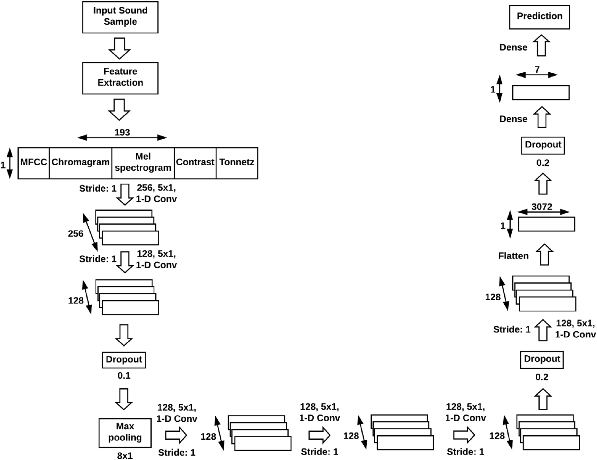

# Implementation of Speech emotion recognition with deep convolutional neural networks  

<h1 align="center">
  <br>
Speech emotion recognition with deep convolutional neural networks
  <br>
</h1>

> **Speech emotion recognition with deep convolutional neural networks**<br>
> Dias Issa, M. Fatih Demirci, Adnan Yazici<br>
>
> **Abstract:** *The speech emotion recognition (or, classification) is one of the most challenging topics in data science. Inthis work, we introduce a new architecture, which extracts mel-frequency cepstral coefficients, chroma-gram, mel-scale spectrogram, Tonnetz representation, and spectral contrast features from sound files anduses them as inputs for the one-dimensional Convolutional Neural Network for the identification of emo-tions using samples from the Ryerson Audio-Visual Database of Emotional Speech and Song (RAVDESS),Berlin (EMO-DB), and Interactive Emotional Dyadic Motion Capture (IEMOCAP) datasets. We utilize anincremental method for modifying our initial model in order to improve classification accuracy. All ofthe proposed models work directly with raw sound data without the need for conversion to visual repre-sentations, unlike some previous approaches. Based on experimental results, our best-performing modeloutperforms existing frameworks for RAVDESS and IEMOCAP, thus setting the new state-of-the-art. Forthe EMO-DB dataset, it outperforms all previous works except one but compares favorably with that onein terms of generality, simplicity, and applicability. Specifically, the proposed framework obtains 71.61%for RAVDESS with 8 classes, 86.1% for EMO-DB with 535 samples in 7 classes, 95.71% for EMO-DB with 520samples in 7 classes, and 64.3% for IEMOCAP with 4 classes in speaker-independent audio classificationtasks.*

<h4 align="center"><a href="https://www.sciencedirect.com/science/article/abs/pii/S1746809420300501">link to paper</a></h4>


## Usage  
This repository can be used in the following ways:  
1. Using `train.py`. Download the dataset of your choice and put it either in the `train_data` directory or mention the train_dir using command line arguments. You can mention the model architecture. More on that below.  
2. Using `SpeechModel.py` to get a Keras Model into your code. This model follows specificatoins mentioned in the paper. You may write your own dataset code.  
3. Using just the `process_audio_clip` function from `utils.py`, you can write your own dataset funcion, as well as your own model. This function returns a `(193,1)` shaped array that can be fed to a CNN or any other architecture of your wish.  

### Example Usage
``` python trian.py -B 64 15```  
(Runs the training function with default parameters, batch size of 64 for 15 epochs)

## Training your model
- Use `python train.py -h` to see a list of arguments.  

### Dataset: 
- Audio files can be put in the `./train_data` folder or specified to the `train.py` file using the `--train_dir` argument. 


## Saved Model
- The model will be saved post training in the "saved_model" directory. 
- Checkpoints feature pending

## Environment Setup
`Librosa` needs `sondfile` to work. Install it via:  
`sudo apt-get install libsndfile1`  

Tested with:  
- Python=3.9  
- Tensorflow=2.7  
- Librosa=0.81
- scikit-learn=1.0.1

## Model Description
The baseline model uses a series of Convolution layers with Dropout and BatchNormalizatoin layers at specific positions. The presence and position of these BatchNormalization and Dropout layers with their respective hyperparameters are varied based on the model. The base model is described below:  
<center></center>
There are serveral variations of the baseline model described in the paper. Ensemble models are not implemented in this repo.  

Models available:  
1. RAVDESS Model  
2. EMO-DB Model  
3. IEMOCAP Model

## Limitations
1. Currently this repo only supports dataset preparation for the RAVDESS model since different datasets describe their labels differently. You can still use this repo with other datasets by defining your own function to load the datasets and using the `process_audio_clip` function from `utils.py`.  
Then you may use `SpeechModel.py` to create a model based on specifications form the paper and train.  
2. There are warning from librosa regarding minimum n_fft window being too large for certain samples. This has to be tuned on the basis of how big our files are. Currently its on the default size of `n_fft=1024` which may be too large for smaller samples.

## Credits and acknowledgements:
I did this work for a hackathon. This method did not produce the best results for my use case. I suspect this was due to the dataset being very noisy.

## Citation

>
    Dias Issa, M. Fatih Demirci, Adnan Yazici,
    Speech emotion recognition with deep convolutional neural networks,
    Biomedical Signal Processing and Control,
    Volume 59,
    2020,
    101894,
    ISSN 1746-8094,
    https://doi.org/10.1016/j.bspc.2020.101894.
    (https://www.sciencedirect.com/science/article/pii/S1746809420300501)
    Abstract: The speech emotion recognition (or, classification) is one of the most challenging topics in data science. In this work, we introduce a new architecture, which extracts mel-frequency cepstral coefficients, chromagram, mel-scale spectrogram, Tonnetz representation, and spectral contrast features from sound files and uses them as inputs for the one-dimensional Convolutional Neural Network for the identification of emotions using samples from the Ryerson Audio-Visual Database of Emotional Speech and Song (RAVDESS), Berlin (EMO-DB), and Interactive Emotional Dyadic Motion Capture (IEMOCAP) datasets. We utilize an incremental method for modifying our initial model in order to improve classification accuracy. All of the proposed models work directly with raw sound data without the need for conversion to visual representations, unlike some previous approaches. Based on experimental results, our best-performing model outperforms existing frameworks for RAVDESS and IEMOCAP, thus setting the new state-of-the-art. For the EMO-DB dataset, it outperforms all previous works except one but compares favorably with that one in terms of generality, simplicity, and applicability. Specifically, the proposed framework obtains 71.61% for RAVDESS with 8 classes, 86.1% for EMO-DB with 535 samples in 7 classes, 95.71% for EMO-DB with 520 samples in 7 classes, and 64.3% for IEMOCAP with 4 classes in speaker-independent audio classification tasks.
    Keywords: Speech emotion recognition; Deep learning; Signal processing

